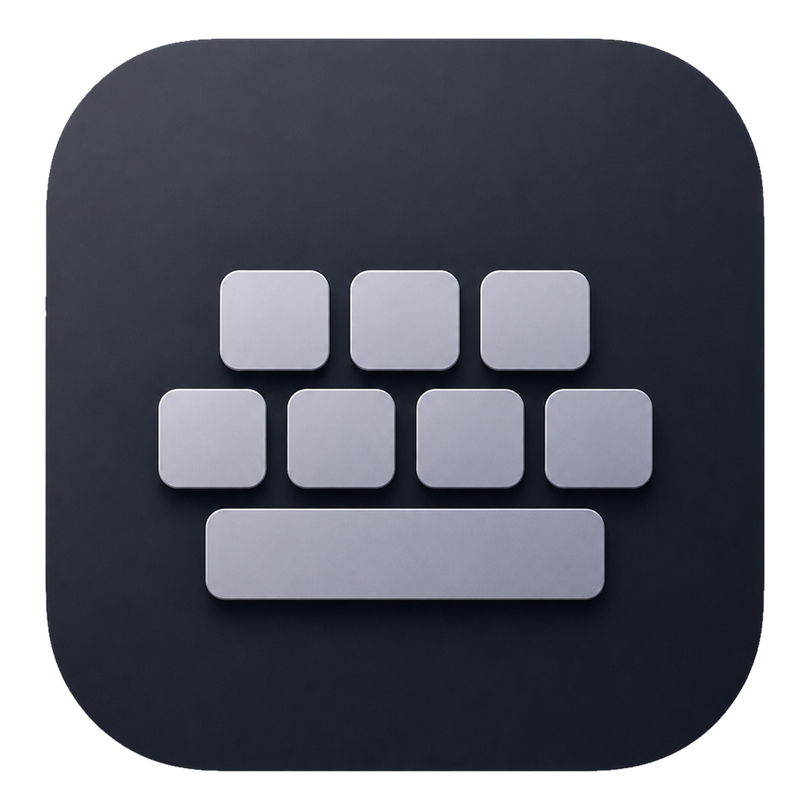
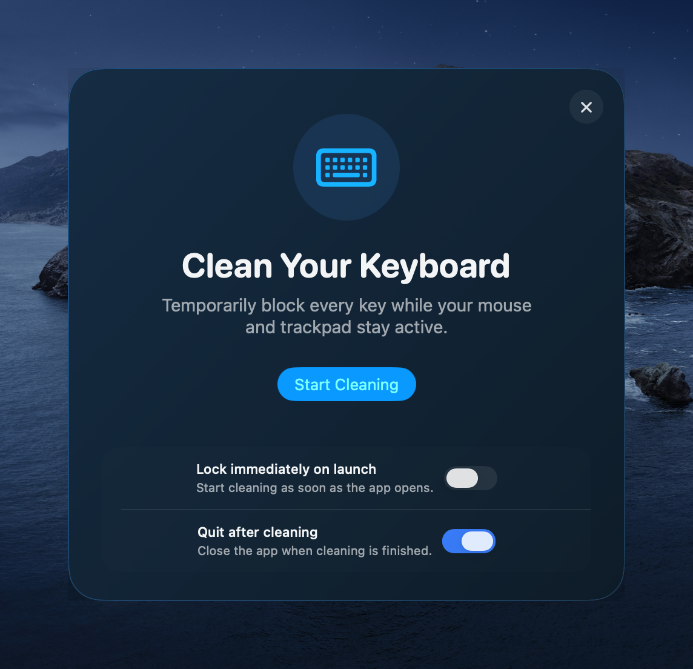

<div align="center">
  
  <h1>OpenKeyboardCleanTool</h1>
  <p><strong>Lock the keys. Keep the trackpad. Clean your Mac.</strong></p>
  <p>
    
    
    
    
    <a href="https://github.com/max1874/open-keyboard-clean-tool/actions/workflows/ci.yml"></a>
  </p>
</div>

OpenKeyboardCleanTool is a tiny, open-source macOS app made for one job: temporarily block every keyboard key while you clean, without disabling your mouse or trackpad.

<p align="center">
  
</p>

## Why this app

- **Open only when needed.** No menu-bar item, login item, daemon, or background helper.
- **Mouse stays active.** Finish cleaning and quit with one click.
- **Optional instant lock.** Choose whether the keyboard locks as soon as the app opens.
- **Your finish behavior.** Quit automatically after cleaning, or stay open for another round.
- **Native on macOS.** SwiftUI with Liquid Glass on macOS 26 and a material fallback on earlier releases.
- **Private by design.** No network access, analytics, telemetry, or third-party dependencies.

## Requirements

- macOS 13 or later
- Accessibility permission, required by macOS to intercept keyboard events

## Build from source

```sh
git clone https://github.com/max1874/open-keyboard-clean-tool.git
cd open-keyboard-clean-tool
make app
open build/OpenKeyboardCleanTool.app
```

On first launch, allow OpenKeyboardCleanTool in **System Settings → Privacy & Security → Accessibility**, return to the app, and click **Check Again**.

The build uses a local Apple Development certificate so Accessibility permission remains attached across rebuilds. To select one explicitly:

```sh
SIGN_IDENTITY="Apple Development: Your Name (TEAMID)" make app
```

For a one-off unsigned local build:

```sh
SIGN_IDENTITY=- make app
```

Ad-hoc signatures can change identity after rebuilding, so macOS may ask for Accessibility permission again.

## Development

```sh
make test       # Run the Swift test suite
make icon       # Regenerate the app icon asset catalog from Resources/AppIcon.png
```

Keyboard filtering lives entirely inside the foreground process. Normal keys, modifiers, function keys, and media keys are blocked during cleaning; pointer and scroll events pass through. Quitting or a process crash removes the event tap automatically.

## Security and privacy

Accessibility access is powerful. This app uses it only to discard keyboard events while cleaning mode is active. The implementation is small enough to audit, performs no networking, and installs no persistent component.

## License

[MIT](LICENSE) © 2026 Max
